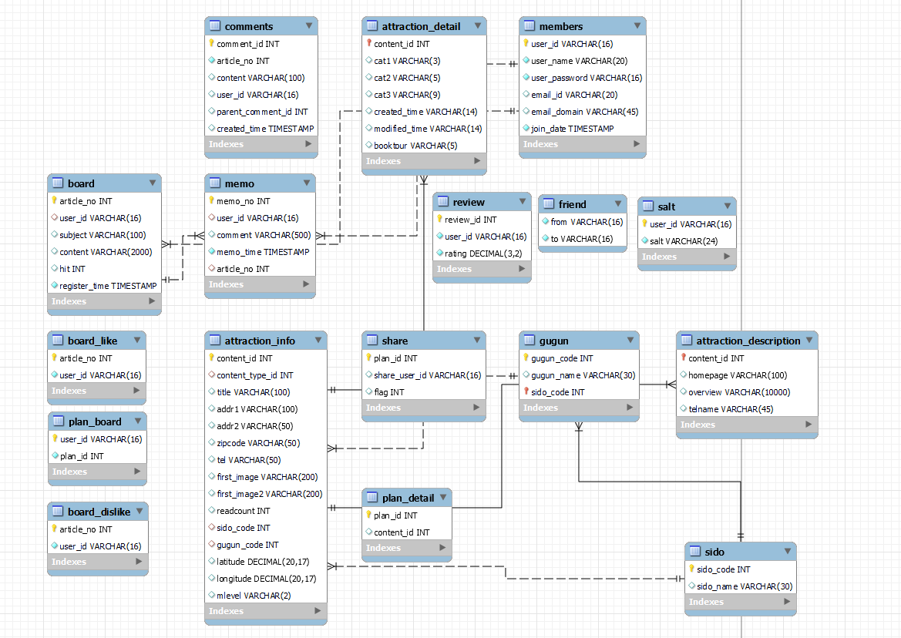
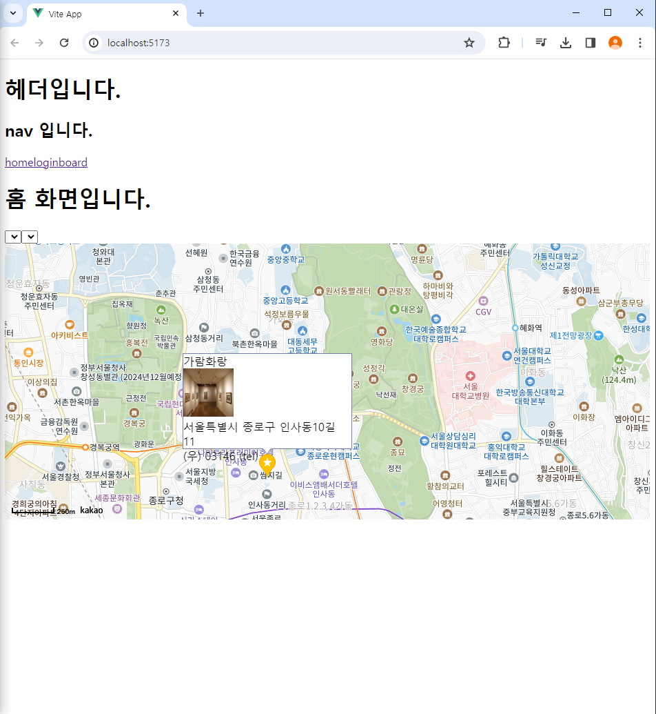
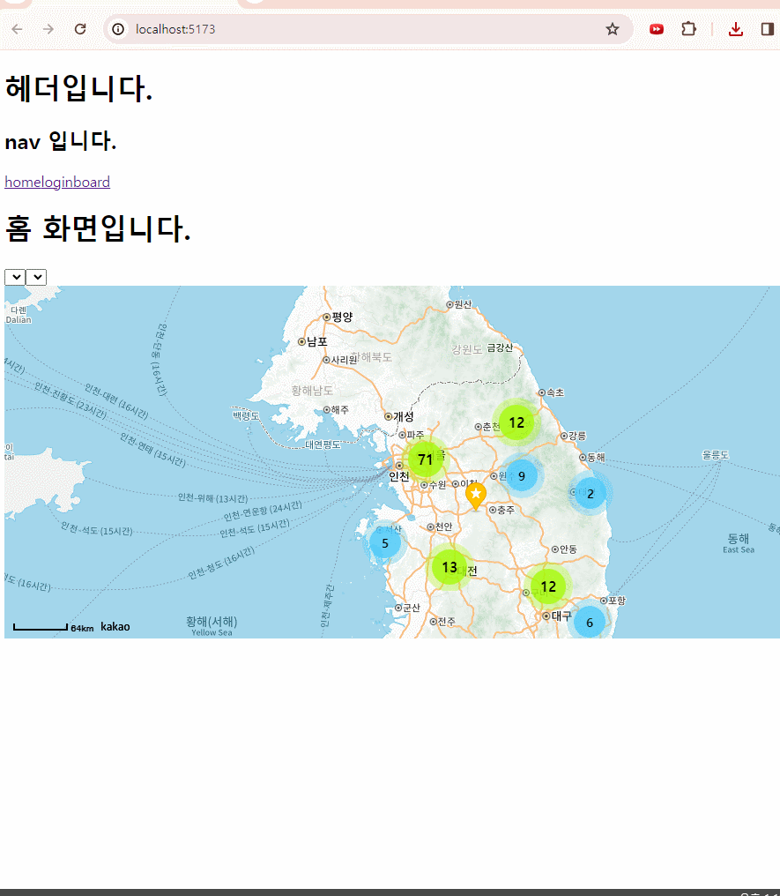
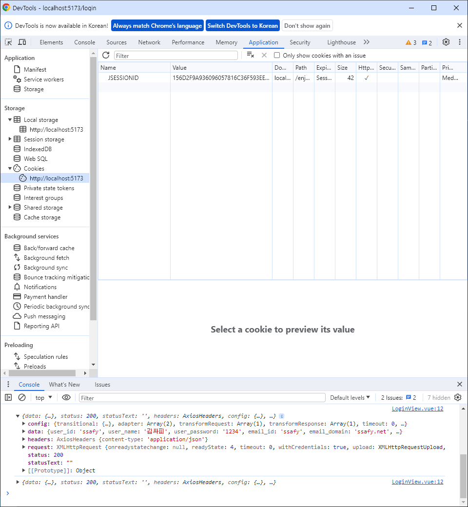
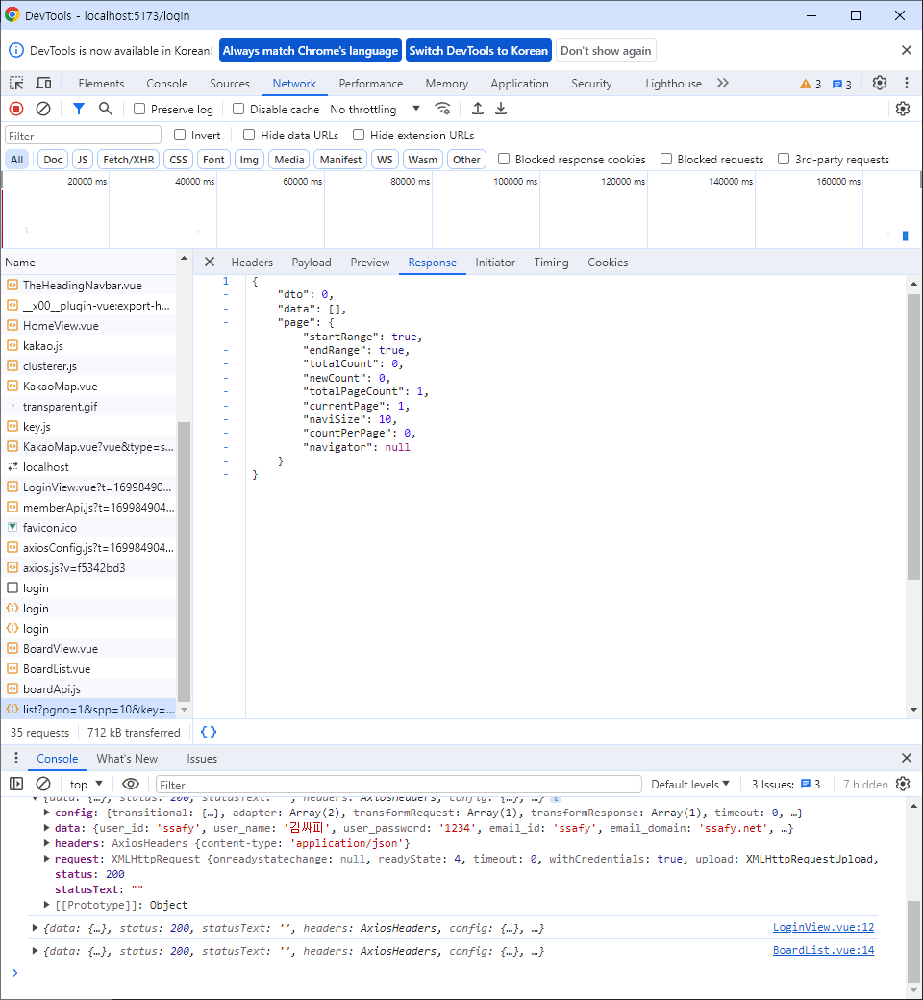
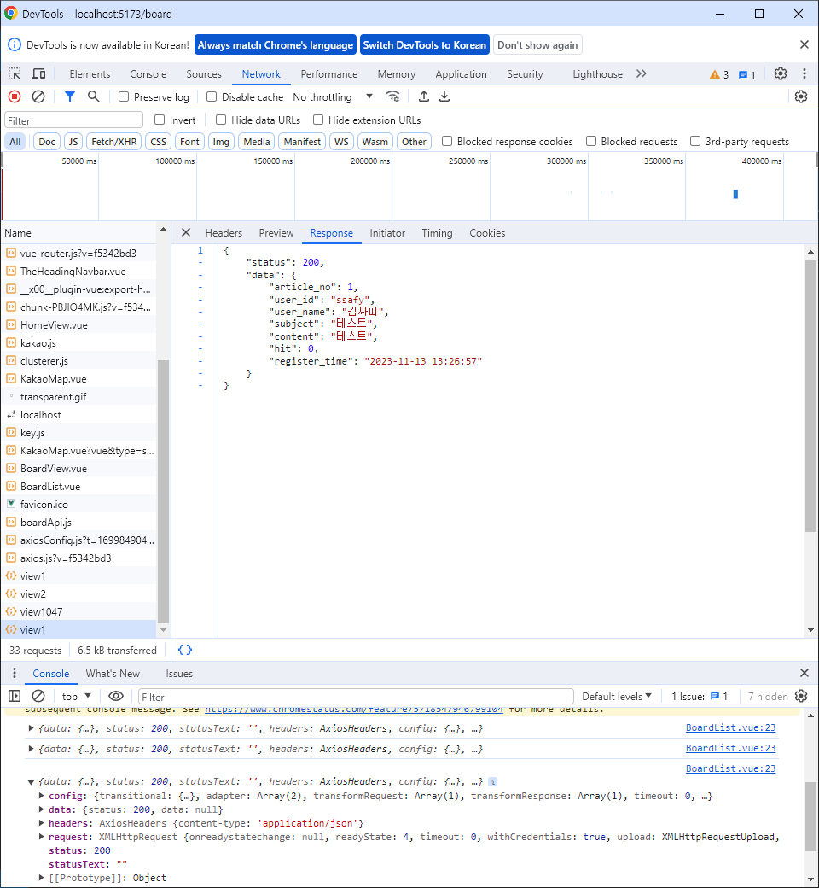

# 이동재, 조현우 Enjoy Trip 프로젝트

## 구현 목록

    최종 프로젝트를 위해 사용될 기능을 테스트하고 추가하는데 목적을 두고 진행하였습니다.

## 구현 상세

### 프론트

- 카카오 맵 및 클러스터링 추가

- 로그인 게시판 라우팅 추가

- 로그인 기능의 경우 스프링부트 백엔드 서버를 통해 데이터 전달 및 뷰 서버에 JSESSION ID 저장

- 게시글 리스트 fetch + 상세보기 데이터 fetch 버튼 추가 (콘솔 로그를 통해 확인)

### 백엔드

- 스프링부트 기반 게시판 및 여행계획 JSON fetch를 통해 status를 포함한 데이터를 전달

- 친구 추가 기능 추가

### DB 스키마 구조

  

### 카카오 맵

- 여행지 지도를 카카오 맵으로 제공합니다.

  

- 여행지를 클러스터링으로 제공합니다.

  

- 클러스터 상세 Floating Div를 제공합니다.

  

### 라우팅

- 로그인, 게시판 라우팅을 제공합니다.

  

### 로그인

- 로그인 내부 기능 및 JSESSION ID 저장.

  

### 게시글

- 게시글 리스트 fetch.

  

- 상세보기 데이터 fetch.

  

## 소감

### 이동재

좋은 페어와 함께 이번 뷰 프로젝트를 진행했습니다.
먼저 페어와 함께 사용할 기능에 대해 생각해보고 DB 테이블을 설계했습니다. 그 다음 서버의 기능인 멤버, 친구, 게시판, 여행지에 해당하는 서비스를 작성한 뒤 기능을 테스트 하기 위해 뷰로 페이지를 구성했습니다.
이번 프로젝트에서는 기능적인 테스트를 위해 화면을 구성해 아쉬움이 있지만 최종 관통 때는 제대로 된 화면 구성을 해야겠다고 생각했습니다. 그리고 기존에 html, css , script 로 구성된 SPA 페이지에서 SFC 로 바꾸는 과정이 어려웠지만 뷰에 대한 이해를 더욱 높일 수 있었습니다.

### 조현우

관심사 별 테스트 페이지를 만들고 추후 최종 프로젝트에 사용할 DB 스키마 및 백엔드 기능 설계에 집중하였습니다. 이와 같은 개발 과정을 학기말까지 이어가며 페이지 디자인 및 기능 사안이 최종 제출 전까지 자주 바뀌는 뷰를 제외한 기능 및 비기능 사항에 초점을 맞춰 개발한 뒤, 디자인을 입히는 방식을 통해 완성도 있는 결과물을 만들도록 하겠습니다.
